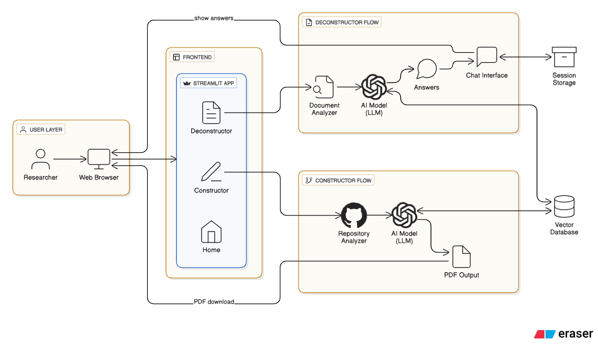
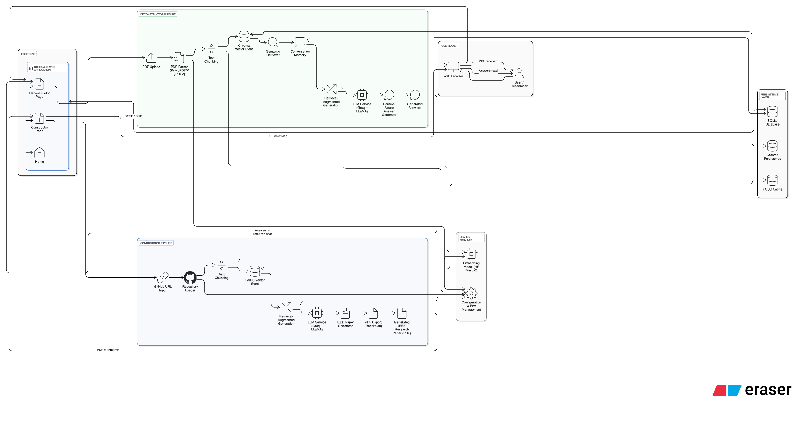

# Research Paper AI Assistant

An AI-powered research assistant that constructs IEEE-formatted research papers from GitHub repositories and deconstructs existing research papers for interactive question-answering.

The system is designed as a dual-mode application to accelerate academic, technical, and research workflows using Retrieval-Augmented Generation (RAG) and LLMs.

---

## Overview

The Research Paper AI Assistant enables researchers, students, and developers to:

- **Generate Papers**: Convert real-world software repositories into structured IEEE-style research papers
- **Analyze Papers**: Interactively explore and question uploaded research papers using document-grounded AI
- **Persist Sessions**: Maintain persistent, multi-session academic workflows using modern LLM infrastructure

---

## Features

### Constructor (Paper Generator)

- Analyze a complete public GitHub repository
- Understand code structure, documentation, and architecture
- Generate a multi-page IEEE-formatted research paper
- Edit sections before PDF generation
- On-demand PDF export

### Deconstructor (Paper Analyzer)

- Upload one or more research paper PDFs
- Build a document-grounded vector knowledge base
- Ask unlimited questions in a single chat session
- Create multiple independent chat sessions
- Persistent document and chat history

---

## Technology Stack

### Frontend
- Streamlit

### LLM Orchestration
- LangChain

### LLM Provider
- Groq  
  - LLaMA-3.1-8B-Instant  
  - LLaMA-3.3-70B-Versatile  

### Vector Databases
- FAISS (Constructor)
- ChromaDB (Deconstructor)

### Embeddings
- Hugging Face Sentence Transformers  
  - all-MiniLM-L6-v2 (384-dimensional embeddings)

### Persistence
- SQLite (sessions and chat history)

### PDF Handling
- ReportLab (PDF generation)
- PyMuPDF / PyPDF2 (PDF parsing)

---

# Architecture Diagrams
## High Level Architecture Diagram

## Low Level Architecture Diagram


## Project Structure

```bash
research-paper-assistant/
│
├── home.py                    # Main entry point
├── requirements.txt           # Python dependencies
├── .env                       # Environment variables (create from .env.example)
├── .gitignore
├── README.md
│
├── pages/
│   ├── Constructor.py         # Paper generation interface
│   └── Deconstructor.py       # Paper analysis interface
│
├── constructor/               # Paper generation module
│   ├── __init__.py
│   ├── app.py
│   ├── analysis.py           # Repository analysis
│   ├── github_loader.py      # GitHub API integration
│   ├── paper_generator.py    # LLM-based paper generation
│   ├── pdf_builder.py        # PDF export
│   └── vectorstore.py        # FAISS vector store
│
├── deconstructor/             # Paper analysis module
│   ├── __init__.py
│   ├── app.py
│   ├── ingestion.py          # PDF ingestion
│   ├── retriever.py          # Document retrieval
│   ├── memory.py             # Conversation memory
│   ├── llm.py                # LLM interface
│   └── database.py           # SQLite session storage
│
├── shared/                    # Shared utilities
│   ├── __init__.py
│   ├── config.py             # Configuration
│   ├── embeddings.py         # Embedding models
│   ├── llm.py                # LLM interface
│   └── text_splitter.py      # Text chunking
│
├── data/
│   ├── chroma/               # ChromaDB vector store
│   ├── faiss_cache/          # FAISS indices cache
│   └── sessions.db           # SQLite database
│
└── docs/
    ├── high_level_architecture.png
    └── low_level_architecture.png
```
---

## Prerequisites

Before starting, ensure you have:

- Python 3.9+ installed
- A Groq API key (free at https://console.groq.com)
- Optional: GitHub token for higher API rate limits (https://github.com/settings/tokens)

---

## Setup Instructions

### 1. Environment Configuration

Create a `.env` file in the project root:

```bash
# Copy the example
cp .env.example .env

# Then edit .env with your API keys:
GROQ_API_KEY=your_groq_api_key_here
GITHUB_TOKEN=your_github_token_here  # Optional but recommended
LANGCHAIN_PROJECT=ResearchPaper-Assistant
```

**Get API Keys:**
- **Groq API**: https://console.groq.com (free tier available)
- **GitHub Token**: https://github.com/settings/tokens (select `repo` scope)

### 2. Installation

```bash
# Clone the repository
git clone <repository-url>
cd research-paper-assistant

# Create virtual environment
python -m venv venv

# Activate virtual environment
# On Windows:
venv\Scripts\activate
# On Linux/macOS:
source venv/bin/activate

# Install dependencies
pip install -r requirements.txt
```

### 3. Run the Application

```bash
streamlit run home.py
```

The app will open at: **http://localhost:8501**


## Usage Guide

### Constructor: Generate Papers from GitHub

1. Navigate to **Constructor** page via sidebar
2. Enter a GitHub repository URL (e.g., `https://github.com/owner/repo`)
3. Provide Author Name and Institution
4. Click **Generate Paper**
5. Wait for processing (may take 2-5 minutes for larger repos)
6. Review the generated paper preview
7. Download as PDF

**Tips:**
- Start with smaller repos (<50 files) for testing
- Ensure the repo is public and accessible
- The app will show API rate limit status in the sidebar

### Deconstructor: Analyze Research Papers

1. Navigate to **Deconstructor** page via sidebar
2. Click **➕ New Chat** to create a chat session
3. Upload one or more PDF research papers
4. Click **Process** to ingest the documents
5. Ask questions in the chat interface
6. View persistent chat history

**Features:**
- Multiple independent chat sessions
- Document-grounded responses with context retrieval
- Full chat history saved to database
- Switch between sessions anytime


## Design Principles

1. **Modular Architecture**: Clean separation between Constructor and Deconstructor modules
2. **Persistent Storage**: SQLite for sessions, ChromaDB/FAISS for vectors, file system for PDFs
3. **Transparent Logic**: No hidden assumptions; all API calls logged and monitored
4. **Performance Optimized**: Caching, lazy loading, and efficient database queries
5. **Error Handling**: Graceful degradation with user-friendly error messages

---

## Performance Optimizations

The application includes several optimizations for faster loading:

- **Page Config First**: Streamlit page configuration before heavy imports
- **Embedding Caching**: HuggingFace model cached with `@st.cache_resource`
- **Database Query Caching**: Session lists cached with TTL (60 seconds)
- **Lazy PDF Upload**: File uploader hidden in collapsible section
- **Batch Processing**: Documents processed in parallel where possible

See [PERFORMANCE_OPTIMIZATIONS.md](PERFORMANCE_OPTIMIZATIONS.md) for details.

---

## Troubleshooting

### GitHub API Rate Limit Error

**Problem**: `401 Unauthorized` or rate limit exceeded

**Solutions**:
1. Generate a new GitHub token: https://github.com/settings/tokens
2. Reduce `max_files` parameter in Constructor (currently 40)
3. Wait for rate limit reset (shown in sidebar)
4. Use a token with proper `repo` scope

See [GITHUB_API_RATE_LIMIT.md](GITHUB_API_RATE_LIMIT.md) for complete guide.

### Slow Page Loading

**Problem**: Constructor/Deconstructor pages take 4+ seconds to load

**Solutions**:
1. App uses caching - first load is slower, subsequent loads are fast
2. Check Python version: Python 3.9+ recommended
3. Verify internet connection for first model download
4. Use `streamlit run home.py --logger.level=error` to reduce logging

### PDF Processing Issues

**Problem**: PDF upload fails or documents not recognized

**Solutions**:
1. Ensure PDFs are text-based (not scanned images)
2. Try smaller PDFs first (< 50 MB)
3. Check file permissions in temp directory
4. Verify LangChain-ChromaDB installation

---

## Important Notes

- **Security**: Never commit `.env` files with real API keys to version control
- **Rate Limits**: GitHub API limited to 5000 req/hour with token, 60 without
- **Storage**: Persistent data stored in `data/` directory (includes vector embeddings)
- **Performance**: Large repos (1000+ files) may take significant time to process
- **Memory**: Embedding model (~400MB) loaded on first use

---

## Key Features

### ✅ Implemented
- IEEE-formatted paper generation from GitHub repos
- Document-grounded Q&A on research papers
- Multi-session persistent chat history
- PDF generation and export
- GitHub API integration with rate limit handling
- SQLite session/message persistence
- Vector similarity search (FAISS + ChromaDB)
- LangChain orchestration with Groq LLM

### 🚀 Future Enhancements
- Citation graph generation
- Multi-paper comparative analysis
- Docker containerization
- Cloud deployment (AWS/GCP)
- Additional academic templates (APA, MLA, etc.)
- Paper annotation and highlighting
- Real-time collaboration features

---

## License & Attribution

This project is intended for **educational and research use only**.

**Important**: Users must ensure compliance with:
- Individual GitHub repository licenses when generating research papers
- Groq and LangChain terms of service
- Academic integrity policies of your institution

---

## Contributing

Contributions are welcome! Please:

1. Fork the repository
2. Create a feature branch: `git checkout -b feature/your-feature`
3. Commit changes: `git commit -m 'Add feature'`
4. Push to branch: `git push origin feature/your-feature`
5. Submit a Pull Request

---

## Support & Issues

- **Report Bugs**: Create an issue with detailed reproduction steps
- **Feature Requests**: Use GitHub discussions
- **Questions**: Check existing issues first, then ask in discussions

---

## Citation

If you use this project in research, please cite:

```bibtex
@software{research_paper_assistant_2026,
  title={Research Paper AI Assistant},
  author={Your Name},
  year={2026},
  url={https://github.com/yourusername/research-paper-assistant}
}
```

---

**Last Updated**: February 3, 2026  
**Version**: 1.0.0  
**Status**: ✅ Production Ready
